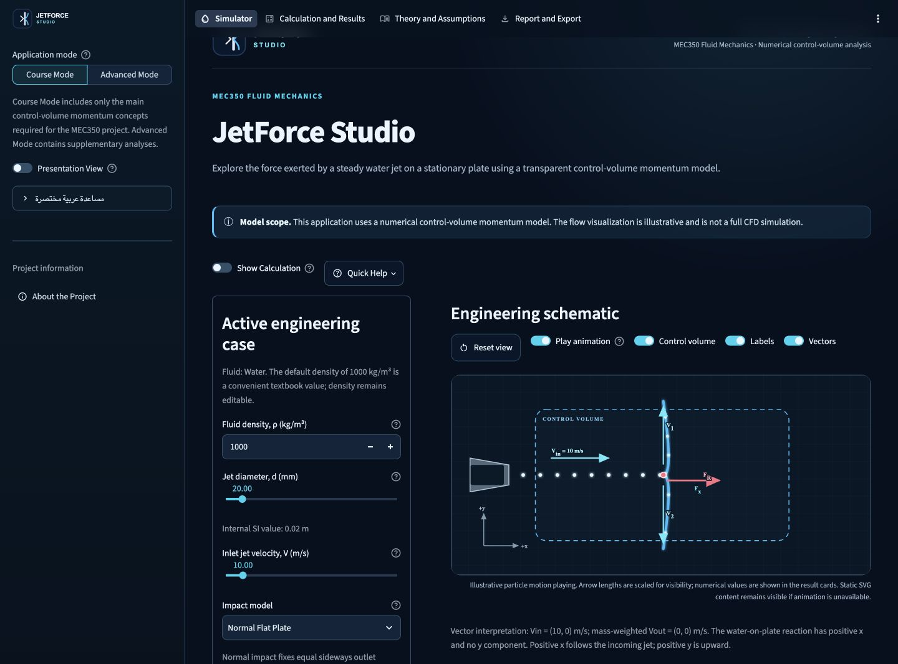

# JetForce Studio

JetForce Studio is an MEC350 educational Streamlit application for the steady, two-dimensional control-volume momentum analysis of a water jet striking a stationary flat plate or curved guide. It reports the force exerted by the water on the plate and never presents its illustration as a spatial flow-field solution.

> **Model scope:** This application uses a numerical control-volume momentum model. The flow visualization is illustrative and is not a full CFD simulation.

## Screenshots and static presentation backup



The [presentation backup](presentation_backup/) contains a default simulator screenshot, hand-calculation PDF and HTML, a result table, and the two key Course Mode charts. These are labeled fallback snapshots; the live application remains the authoritative interactive view.

## Main features

- A complete default water case is visible immediately: `rho = 1000 kg/m3`, `d = 0.02 m`, `V = 10 m/s`, normal flat plate.
- Responsive animated engineering schematic with nozzle, jet, plate, control volume, axes, velocity vectors, and force vectors.
- Primary results `Fx`, `Fy`, and `FR`, plus `A`, `Q`, and mass flow.
- Step-by-step hand calculation and analytical verification.
- Force-versus-velocity and force-versus-diameter studies with in-memory CSV download.
- In-memory case CSV, JSON, printable HTML, and PDF report exports.
- Presentation View and three one-click classroom demonstration cases.
- No visitor login, upload, API key, database, advertising, or runtime external API.

## Course Mode

Every fresh browser session begins in Course Mode. It contains only the main concepts required for the MEC350 project:

- Water with editable density and a clearly labeled textbook default of `1000 kg/m3`.
- Jet diameter, inlet velocity, impact model, and outlet angle only when needed.
- SI units only.
- Normal Flat Plate and Deflected Jet / Curved Plate Comparison.
- Main momentum equation, `Fx`, `Fy`, `FR`, `A`, `Q`, and mass flow.
- Velocity and diameter studies only.

The approximate room-temperature water preset of `998 kg/m3` remains available in Advanced Mode.

## Advanced Mode

Advanced Mode is optional and supplementary. It adds water, air, and custom-fluid presets; dynamic viscosity and Reynolds number as context; user-selected velocity retention `k`; split flow; ideal/non-ideal comparison; extra parameter studies; detailed momentum data; and US customary display units. The coefficient `k` is a prescribed modeling assumption, not a CFD result or Reynolds-number correction.

## Governing equations and sign convention

All calculations use unrounded binary64 values in SI units:

```text
A = pi d^2 / 4
Q = A V
mdot = rho Q
F_plate = mdot V_in - sum(mdot_j V_out,j)
Fx = x-component of F_plate
Fy = y-component of F_plate
FR = sqrt(Fx^2 + Fy^2)
```

- Positive `x` follows the incoming jet.
- Positive `y` is upward.
- `Vin = (V, 0)`.
- Reported forces are the reaction exerted by the water on the plate.
- The force exerted by the plate on the control-volume fluid is equal and opposite.

For the default normal-impact case:

```text
A    = 0.0003141592653589793 m2
Q    = 0.003141592653589793 m3/s
mdot = 3.141592653589793 kg/s
Fx   = 31.41592653589793 N
Fy   = 0 N
FR   = 31.41592653589793 N
```

## Assumptions

- Steady flow with no mass or momentum accumulation.
- Incompressible fluid with constant density.
- Uniform section-average inlet and outlet velocities.
- Exposed free-jet sections at atmospheric pressure, so gauge-pressure terms there are zero.
- Stationary rigid plate or vane.
- Gravity and air drag neglected across the compact impact control volume.
- Circular undisturbed inlet jet.
- Outlet mass flow equals inlet mass flow.
- Two-dimensional momentum balance.
- Any Advanced Mode loss is represented only by user-selected `k`.

More detail is in [equations.md](docs/equations.md) and [model_assumptions.md](docs/model_assumptions.md).

## Installation

Python 3.11, 3.12, or 3.13 is required. Python 3.11 is the deployment baseline.

```bash
python3.11 -m venv .venv
source .venv/bin/activate
python -m pip install -r requirements.txt
```

Exact local run command:

```bash
streamlit run app.py
```

The Streamlit entry point is `app.py`.

### Windows

```bat
py -3.11 -m venv .venv
.venv\Scripts\activate
python -m pip install -r requirements.txt
streamlit run app.py
```

You can then use `run_windows.bat`.

### macOS

```bash
python3.11 -m venv .venv
source .venv/bin/activate
python -m pip install -r requirements.txt
streamlit run app.py
```

After setup, double-click `run_macos.command` or run `./run_local.sh`.

### Linux

```bash
python3.11 -m venv .venv
source .venv/bin/activate
python -m pip install -r requirements.txt
streamlit run app.py
```

After setup, run `./run_local.sh`.

## Development and testing

Install development tools separately:

```bash
python -m pip install -r requirements-dev.txt
```

Run the quality checks:

```bash
pytest
pytest --cov=src --cov-report=term-missing
ruff check .
black --check .
mypy src app.py app_pages
python -c "import src; import src.reporting; import src.visualizations; print('Imports OK')"
python -m streamlit run app.py --server.headless=true
```

Tests cover the governing equations, sign convention, mass conservation, analytical limits, units, degree conversion, invalid inputs, boundary cases, parameter studies, reports, release integrity, session modes, and Streamlit startup.

## Project structure

```text
app.py                         Streamlit entry point and six-page router
app_pages/                     Simulator, calculation, charts, theory, export, about
src/calculations.py            Authoritative SI physics and vectorized studies
src/models.py                  Typed domain inputs and results
src/course.py                  Course defaults, modes, and demonstration presets
src/validation.py              Input validation and hand-calculation support
src/visualizations.py          Controls, diagrams, metrics, and charts
src/reporting.py               In-memory CSV, JSON, HTML, and PDF exports
tests/                         Automated physics, export, UI, and release checks
assets/                        Local SVG and CSS assets
docs/                          Derivations, assumptions, verification, and guidance
presentation_backup/           Static presentation fallback artifacts
.streamlit/config.toml         Public theme and safe runtime configuration
DEPLOYMENT.md                  Streamlit Community Cloud procedure
RELEASE_CHECKLIST.md           Release and post-deployment checks
Dockerfile                     Optional portable fallback
```

## Public deployment overview

JetForce Studio is publicly deployed on Streamlit Community Cloud from the
`main` branch with `app.py` as the entry point and Python 3.11:

- **Live application:** <https://jetforce-studio-mec350.streamlit.app/>
- **Public source:** <https://github.com/Alharbi75/jetforce-studio>
- **Deployment record:** [DEPLOYMENT.md](DEPLOYMENT.md)
- **Presentation QR code:** [public_app_qr.png](presentation_backup/public_app_qr.png)

The live deployment has been checked for the default Course Mode result, all
six pages, report and study downloads, mobile-width layout, effective 200%
zoom, and browser-console errors. Physical-phone, mobile-data, and independent
second-browser checks remain owner presentation-day checks.

## Privacy

This application does not request personal information and does not store visitor-entered engineering values in a database.

Inputs remain in the visitor's Streamlit session. Exports are generated in memory when requested. The application does not implement analytics, advertising, a cloud database, tracking pixels, or an external runtime API. The hosting platform may separately process technical data required to provide its service.

## Limitations

- No spatial pressure, velocity, turbulence, or free-surface field is solved.
- Jet breakup, splashing, droplets, air entrainment, and nonuniform profiles are not resolved.
- Transient force, torque, plate motion, deformation, and fluid-structure interaction are outside scope.
- Reynolds number is diagnostic only.
- Analytical checks verify equations and software; they are not experimental validation.
- Public hosting may have a cold start after inactivity.
- The optional Docker image is provided as a portable fallback and must be built and tested where a container engine is available.

## Academic honesty

Review all inputs, units, assumptions, results, and exports. Complete student fields yourself, write a case-specific discussion, cite only references you have checked, and follow your institution's academic-integrity policy. Do not present the schematic as CFD or analytical agreement as experimental validation.

## Troubleshooting

- **Python version error:** use Python 3.11, 3.12, or 3.13.
- **`streamlit` not found:** activate the virtual environment and reinstall `requirements.txt`.
- **PDF unavailable:** verify that ReportLab installed; printable HTML remains available.
- **Invalid diameter or density:** enter a positive value within the visible engineering range.
- **Zero velocity:** zero flow and zero force are valid; force direction is not applicable.
- **Stale report downloads hidden:** regenerate the package after changing a case or report field.
- **Port already in use:** start with `streamlit run app.py --server.port 8502`.

No software license has been selected by the project owner, so no license file is included in this release.
